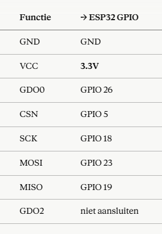

# ESP32 + CC1101 Receiver

Eenvoudig project om een **CC1101 RF-module** te laten communiceren met een **ESP32** (CH340 / NodeMCU-32S / WROOM-32 / ESP-WROOM-32) voor het **ontvangen (sniffen) van RF-signalen**, met behulp van de [SmartRC-CC1101-Driver-Lib](https://github.com/LSatan/SmartRC-CC1101-Driver-Lib).

Feedback en suggesties zijn van harte welkom — zie de sectie [Feedback welkom](#feedback-welkom) onderaan.

## Hardware

- ESP32 development board (CH340 / NodeMCU-32S / WROOM-32 / ESP-WROOM-32)
- CC1101 RF-module (433/868/915 MHz, afhankelijk van versie)
- Jumperwires

## Pinbezetting

| Functie (CC1101) | → ESP32 GPIO |
|---|---|
| GND | GND |
| VCC | **3.3V** |
| GDO0 | GPIO 26 |
| CSN | GPIO 5 |
| SCK | GPIO 18 |
| MOSI | GPIO 23 |
| MISO | GPIO 19 |
| GDO2 | niet aansluiten |

> ⚠️ De CC1101 werkt op **3.3V**, niet op 5V. Sluit VCC dus aan op de 3.3V-pin van de ESP32.

## Installatie

1. Installeer de [Arduino IDE](https://www.arduino.cc/en/software) (of gebruik PlatformIO).
2. Installeer ondersteuning voor ESP32-boards via de Boards Manager.
3. Installeer de library **SmartRC-CC1101-Driver-Lib**:
   - Via Arduino IDE: `Sketch → Include Library → Manage Libraries` → zoek op `SmartRC-CC1101-Driver-Lib`
   - Of handmatig via [GitHub](https://github.com/LSatan/SmartRC-CC1101-Driver-Lib) (ZIP downloaden en toevoegen via `Sketch → Include Library → Add .ZIP Library`)
4. Sluit de hardware aan volgens de pinbezetting hierboven.
5. Open `esp32_cc1101_receiver.ino`, pas indien nodig de frequentie (`MHZ`) aan naar de band die je wil ontvangen.
6. Upload de sketch naar je ESP32 en open de Serial Monitor op **115200 baud**.

## Werking

De sketch:
- Initialiseert de CC1101 via SPI met de hierboven gedefinieerde pinnen
- Controleert of de chip correct wordt herkend
- Zet de module in ontvangstmodus (`SetRx()`) op de ingestelde frequentie
- Print ontvangen pakketjes (hex), samen met RSSI (signaalsterkte) en LQI (linkkwaliteit) naar de Serial Monitor

## Bekende beperkingen / openstaande vragen

- De huidige instellingen gebruiken de standaard modulatie (2-FSK/GFSK) van de library. Voor specifieke protocollen (bv. weerstations, garagedeuren, deurbellen) zijn vaak andere instellingen voor modulatie, datarate en bandbreedte nodig.
- Getest op 433.92 MHz — nog niet uitgebreid getest op 868/915 MHz varianten van de CC1101.
- GDO2 wordt momenteel niet gebruikt; mogelijk relevant voor toekomstige uitbreidingen (bv. CRC-status uitlezen).

## Feedback welkom

Dit project is een werk in uitvoering. Specifiek sta ik open voor feedback over:

- Optimale instellingen voor `setRxBW()`, `setDRate()` en `setModulation()` bij specifieke signalen
- Stabiliteit van de SPI-verbinding bij langere kabels
- Suggesties om GDO2 nuttig te gebruiken

Voel je vrij om een **Issue** te openen voor vragen/bugs, of een **Pull Request** met verbeteringen.

## Licentie

MIT — vrij te gebruiken en aan te passen.
